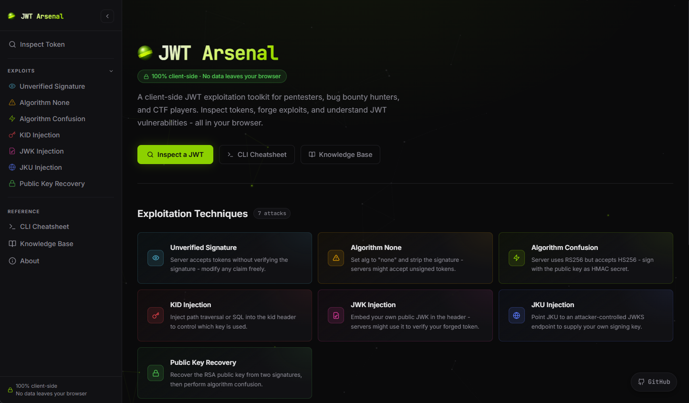
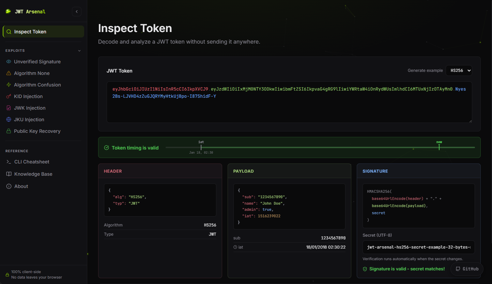

<div align="center">


# JWT Arsenal

**The open-source JWT exploitation toolkit - built for the browser.**

[](https://jwtarsenal.com)
[](LICENSE)
[](CONTRIBUTING.md)

Forge, inspect, and exploit JWT vulnerabilities **entirely in your browser**.  
No backend. No data leaves your machine. No setup required.

**[→ Open the app](https://jwtarsenal.com)** · [Knowledge Base](https://jwtarsenal.com/knowledge-base) · [Cheatsheet](https://jwtarsenal.com/cheatsheet)

</div>

---

[](https://jwtarsenal.com)

---

[](https://jwtarsenal.com)

---

## 🎯 What is JWT Arsenal?

JWT Arsenal is a client-side security toolkit for **pentesters**, **CTF players**, and **bug bounty hunters** who need to test JWT implementations - fast. Every cryptographic operation runs locally in your browser using the Web Crypto API and [jose](https://github.com/panva/jose). Nothing is ever sent to a server.

---

## ✨ Features

### 🔍 JWT Inspector

Paste any token for an instant breakdown - decoded header, payload, raw signature bytes, algorithm info, and expiration status. Your first stop on any JWT engagement.

### ⚔️ Exploit Tools

| Tool | Attack |
|------|--------|
| 🔓 **Unverified Signature** | Server decodes the token but never verifies the signature |
| 🚫 **Algorithm None** | Strip the signature using `alg: "none"` - all casing variants tested |
| ⚡ **Algorithm Confusion** | Switch `RS256` → `HS256`, sign with the public key as HMAC secret |
| 🔑 **KID Injection** | Path traversal, SQL injection, and null-byte payloads via the `kid` header |
| 📄 **JWK Injection** | Embed your own RSA public key in the JWT header |
| 🌐 **JKU Injection** | Point `jku` to an attacker-controlled JWKS endpoint |
| 🔬 **Public Key Recovery** | Recover RSA keys from two signatures via GCD, chain to algorithm confusion |

### 📚 Knowledge Base

In-depth technical articles - from the JOSE RFC family to real PortSwigger Research findings - with working code examples in Python and JavaScript.

### 📋 CLI Cheatsheet

Ready-to-copy commands for `hashcat` (GPU cracking), `jwt_tool`, `rsa_sign2n`, and Python snippets for operations too compute-heavy for the browser.

---

## 🔒 Privacy First

- **Zero backend** - served from a CDN, no server-side code
- **Zero telemetry** - no application-side telemetry or tracking
- **Zero network calls at runtime** - all crypto runs via the browser's native Web Crypto API

---

## 🚀 Getting Started

### Prerequisites

- Node.js >= 20
- npm >= 9

### Run locally

```bash
# Clone the repo
git clone https://github.com/HiitCat/jwt-arsenal.git
cd jwt-arsenal

# Install dependencies
npm install

# Start the dev server
npm run dev

# Open http://localhost:3000 in your browser
```

---

## 🤝 Contributing

Contributions are welcome - new exploit modules, knowledge base articles, bug fixes, UI improvements, translations. All are appreciated.

### How to contribute

1. **Fork** the repository and clone it locally
2. Create a **feature branch**: `git checkout -b feat/my-improvement`
3. Make your changes and verify the build: `npm run build`
4. Open a **Pull Request** with a clear description of what you changed and why

### Adding a new exploit tool

1. Create `app/exploit/<slug>/page.tsx` - use `ExploitLayout` as the wrapper
2. Add a `layout.tsx` in the same folder exporting `metadata` via `pageMeta()`
3. Register the route in `app/sitemap.ts`
4. Optionally write a Knowledge Base article in `app/knowledge-base/<slug>/page.tsx`

### Adding a Knowledge Base article

1. Add the topic metadata to `lib/kbTopics.ts` (title, description, color, tags…)
2. Create `app/knowledge-base/<slug>/page.tsx` using `KbArticle`, `H2`, `P`, `CodeBlock`
3. Export `metadata` via `pageMeta()` at the top of the file

---

## ⚠️ Legal Disclaimer

JWT Arsenal is designed for **authorized security testing, CTF competitions, and educational use only**.  
Do not use this tool against systems you do not own or have explicit written permission to test.  
The authors accept no liability for misuse. See [about](https://jwtarsenal.com/about) for the full disclaimer.

---

## 📄 License

[MIT](LICENSE) - free to use, modify, and distribute.

---

<div align="center">

Built with 🧪 for the security community.

Like the project? Support it with a ⭐ on GitHub.

</div>
